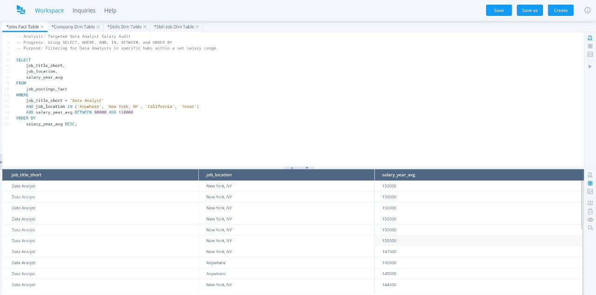

# FinTech-Data-Analysis
"Leveraging SQL to analyze financial datasets, focusing on transaction accuracy, salary trends, and risk-based filtering. Applying BSOA principles to financial data integrity."

   
    #### 🔍 My Personal Findings
While running this audit, I noticed that the top-paying roles in this bracket were heavily concentrated in **New York**. This suggests a high cost-of-living adjustment or a specific demand for Data Analysts in the East Coast financial sector for 2023.

| Job Title | Location | Salary (Avg) |
| :--- | :--- | :--- |
| Data Analyst | New York, NY | $150,000 |
| Data Analyst | Anywhere | $145,000 |

---
### 🛠️ Tools Used
* **Operating System:** Fedora KDE Plasma Desktop 43 (Linux)
* **Database Lab:** sqliteviz
* **Version Control:** GitHub
